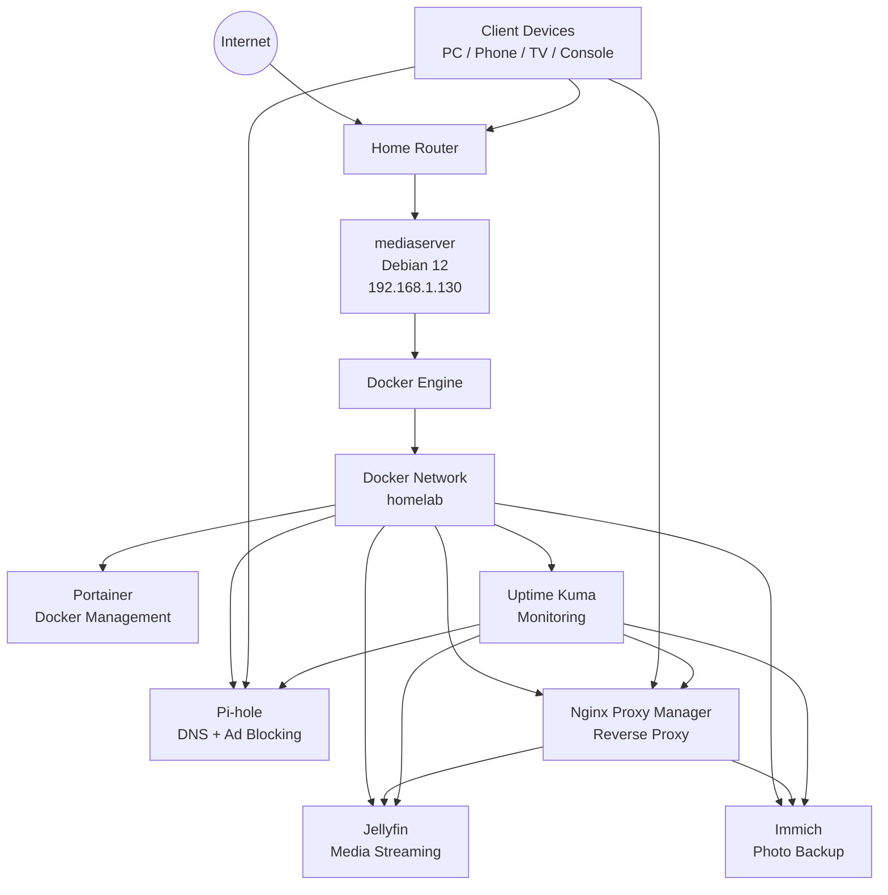

# Architecture Diagram

This diagram shows the current Project Odyssey homelab layout.

## Notes

- `mediaserver` is the main Docker host.
- Docker services run on the shared `homelab` network.
- Pi-hole provides local DNS and ad blocking.
- Nginx Proxy Manager handles friendly service URLs and reverse proxying.
- Uptime Kuma monitors service availability.
- Jellyfin provides media streaming.
- Immich provides photo and video backup.
